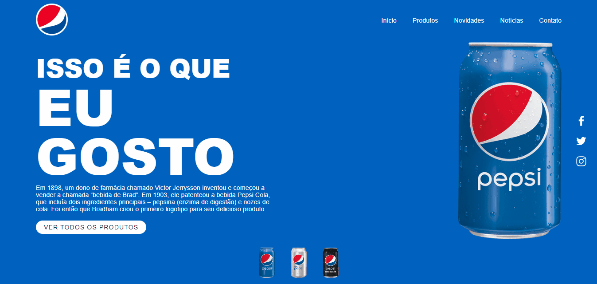

## 🧾 Descrição

Página web que apresenta informações sobre a história da bebida Pepsi e promove seus produtos. A página contém uma seção de cabeçalho com um logotipo, um menu de navegação e links para redes sociais. Na seção de conteúdo, há um texto sobre a história da bebida, uma imagem de destaque e um botão para ver mais produtos. Há também uma seção de miniaturas de imagens para mudar a imagem de destaque, e a cor de fundo da página quando as miniaturas são clicadas. O projeto usa HTML e CSS  para criar uma página web interativa e responsiva.

<h1>

## 🔌 Tecnologias utilizadas

- **HTML:** linguagem de marcação usada para estruturar e apresentar o conteúdo da página;
- **CSS:** linguagem de estilo usada para estilizar a página, incluindo layout, fontes, cores, etc;

## ⚙️ Estrutura

- **img:** Contém imagens utilizadas no projeto e para apresentação no Readme.md;
- **index.html:** Contém a linguagem de marcação usada para estruturar e apresentar o conteúdo da página;
- **style.css:** Contém regras de estilo que são usadas para personalizar a aparência da página HTML. Ele inclui configurações de fonte, cor de fundo, posicionamento e tamanho de elementos, e outras propriedades de estilo para tornar a página mais atraente e fácil de usar.

## 🏳️ Como executar?

### **Passo 1**
Faça download do repositório

### **Passo 2**
Abra o arquivo "Index.html" em um navegador e teste as funções.

 

## ✅ Resultado (Preview)

### **Landing Page**

 

## 💻 Autor: Luan Ferreira

Portfólio:
- [Github](https://github.com/fluanbrito)

Contato:
- [Linkedin](https://www.linkedin.com/in/luanferreirab/)

<h1>

## 🚀 Sobre mim
Sou um grande entusiasta e apaixonado por tecnologia, empreendedorismo e inovação. Hoje, estou a cursar o curso de Sistema de Informação pelo Instituto Federal, faço uso profissionalmente de ferramentas e me aprofundo em temas como Marketing, Machine Learning AWS, Metodologias ágeis, Gestão de Projetos, Programação Web, Administração de Sistemas, Redes de computadores, entre outros.
